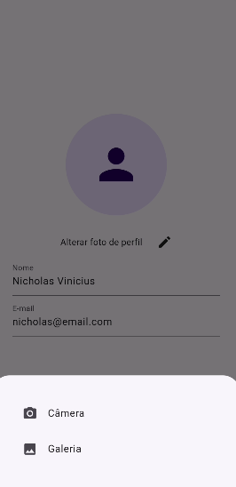

# photo_profile

A new Flutter project.

## Resume

This project consists of a profile screen, where the user is able to change their name, their email, and their profile photo.
For the profile photo he has two options
- Camera
- Gallery

If he chooses camera, another page opens for the user to take a photo, and as soon as the image is captured, a preview appears for him, if the photo is good he confirms, and the photo is changed.

If he chooses gallery, he can choose an image from his own phone.

## Screen

